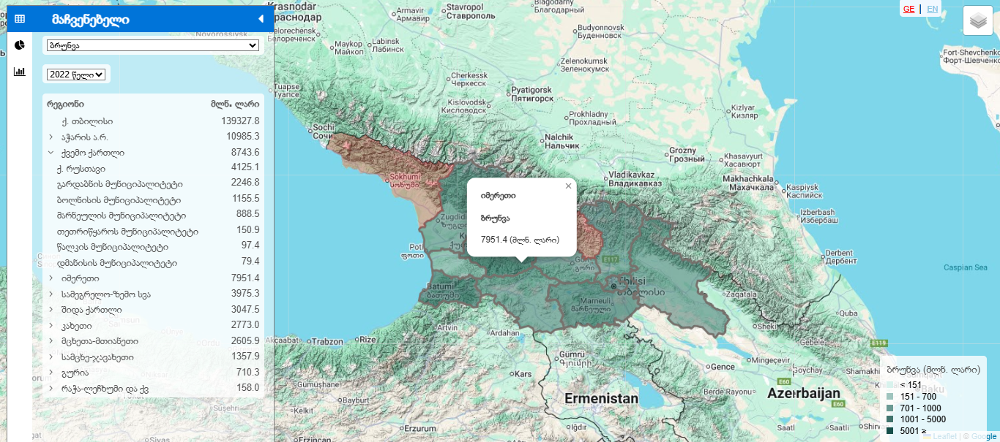

## ⚡ Project: Business Statistics Map

**Interactive Business Statistics Dashboard for Georgia** - Built as a free, accessible tool for researchers, journalists, students, local governments, and anyone interested in Georgia’s economic geography.

Explore turnover, employment, value added, and 10+ other indicators – from regional level down to every single municipality.

---

### ✨ Features

- 🗺️ Interactive Georgia **map** with zoom to all **municipalities** and **regions**
- 📊 Dynamic **pie charts + histograms** for business indicators
- 🎛️ Instantly switch **indicators** (turnover, employment, value added, etc.)
- 📅 Select **years** with easy dropdown
- 💾 Export charts & data: **PDF • Excel • JPG • PNG**
- 🌐 Fully bilingual – **Georgian** ↔ **English** (auto + toggle)
- 📱 100% responsive – perfect on **phones**, **tablets** & **desktop**

---

### 🛠️ Technologies Used

- ⚛️ **Frontend:** [React](https://reactjs.org/)
- 🔄 **State Management:** [Context API](https://react.dev/learn/passing-data-deeply-with-context)
- 📈 **Charts & Visualization:** [amCharts](https://www.amcharts.com/)
- 🗺 **Maps:** GeoJSON and [React Leaflet](https://react-leaflet.js.org/)
- 🎨 **Styling:** [SCSS](https://sass-lang.com/)
- 🚀 **Deployment:** [Vercel](https://vercel.com/)

---

### 🔧 Getting Started

To run this project locally:

```bash
git clone https://github.com/saba-bar95/business-statistics-map
cd business-statistics-map
npm install
npm run dev
```

---

### 🌍 Live Demo

🔗 [Visit Business Statistics Map](https://business-statistics-map.vercel.app/en)

---

### 🖼️ Screenshot



---

### 👨‍💻 Author

[Saba Barbakadze – GitHub Profile](https://github.com/saba-bar95)
